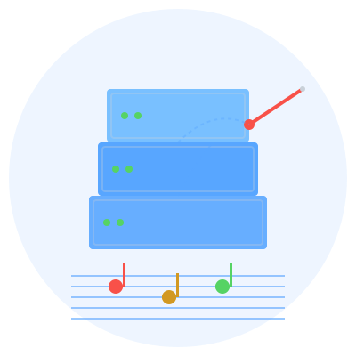
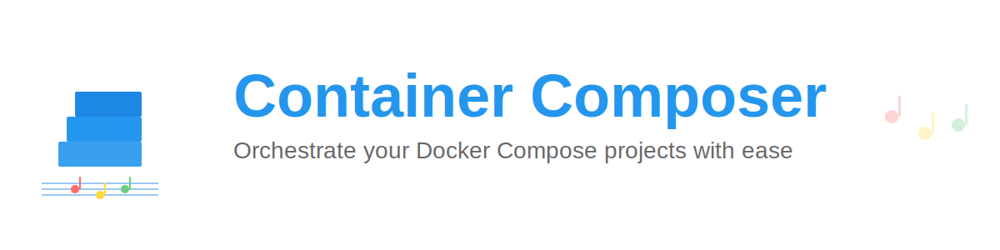

# Container Composer Branding Guide

This document provides visual previews and usage guidelines for Container Composer branding assets.

## Logo Variants

### Main Logo (Light)


**File:** `assets/logo/logo.svg`
**Size:** 400x400
**Use:** Light backgrounds, social media profiles, documentation

---

### Main Logo (Dark)

<div style="background-color: #0d1117; padding: 20px; border-radius: 8px;">
  
</div>

**File:** `assets/logo/logo-dark.svg`
**Size:** 400x400
**Use:** Dark backgrounds, dark mode documentation

---

### Banner



**File:** `assets/logo/banner.svg`
**Size:** 1200x300
**Use:** README headers, presentation slides, website headers

---

### Icon


**File:** `assets/logo/icon.svg`
**Size:** 200x200
**Use:** Favicons, app icons, small spaces, social media thumbnails

---

## Design Elements

### Symbolism

The Container Composer logo combines two key concepts:

1. **Docker Containers** - Represented by stacked boxes with status indicators
   - Shows hierarchy and organization
   - Green dots indicate healthy/running containers
   - Multiple layers represent complex multi-service setups

2. **Musical Composition** - Represented by musical staff and notes
   - Symbolizes orchestration and harmony
   - Different colored notes represent different services working together
   - The conductor's baton represents control and coordination

### Color Palette

#### Light Theme
| Color | Hex | Usage |
|-------|-----|-------|
| Docker Blue | `#2496ED` | Primary brand color, containers |
| Accent Blue | `#1E88E5` | Container highlights |
| Success Green | `#4CAF50` | Status indicators |
| Note Red | `#FF6B6B` | Musical note accent |
| Note Yellow | `#FFD93D` | Musical note accent |
| Note Green | `#6BCF7F` | Musical note accent |

#### Dark Theme
| Color | Hex | Usage |
|-------|-----|-------|
| GitHub Blue | `#58A6FF` | Primary brand color |
| Light Blue | `#79C0FF` | Container highlights |
| Success Green | `#56D364` | Status indicators |
| Error Red | `#F85149` | Musical note accent |
| Warning Yellow | `#D29922` | Musical note accent |
| Gray | `#C9D1D9` | Text and outlines |

---

## Usage Guidelines

### DO ✅

- Use the appropriate theme (light/dark) based on background
- Maintain aspect ratio when scaling
- Provide adequate spacing around the logo (minimum 20px padding)
- Use SVG format for web and documentation
- Convert to PNG for applications that don't support SVG

### DON'T ❌

- Don't distort or stretch the logo
- Don't change the colors arbitrarily
- Don't add drop shadows or effects
- Don't rotate the logo
- Don't place the logo on busy backgrounds without a solid backdrop

---

## File Formats

All logos are provided in SVG format for:
- ✅ Infinite scalability
- ✅ Small file sizes
- ✅ Crisp rendering at any size
- ✅ Easy editing if needed

### Converting to Other Formats

If you need PNG or other formats:

```bash
# Using Inkscape (install first)
inkscape logo.svg --export-png=logo.png --export-width=1024

# Using ImageMagick
convert -background none logo.svg -resize 1024x1024 logo.png

# Using online tools
# Visit: https://convertio.co/svg-png/
```

---

## Social Media Specifications

### GitHub
- **Repository social preview:** 1280x640px (use banner, centered)
- **Organization avatar:** Use icon.svg, minimum 500x500px

### Twitter/X
- **Profile picture:** Use icon.svg, 400x400px recommended
- **Banner:** Use banner.svg, 1500x500px

### LinkedIn
- **Company logo:** Use icon.svg, 300x300px recommended
- **Cover image:** Use banner.svg, 1584x396px

### Dev.to / Hashnode
- **Logo:** Use icon.svg, 512x512px
- **Cover image:** Use banner.svg, 1000x420px

---

## Examples in Use

### README Header
```html
<div align="center">
  
</div>
```

### Documentation Favicon
```html
<link rel="icon" type="image/svg+xml" href="/assets/logo/icon.svg">
```

### Website Header
```html

```

---

## Questions?

For questions about branding and logo usage, please open an issue on GitHub or contact the maintainers.
